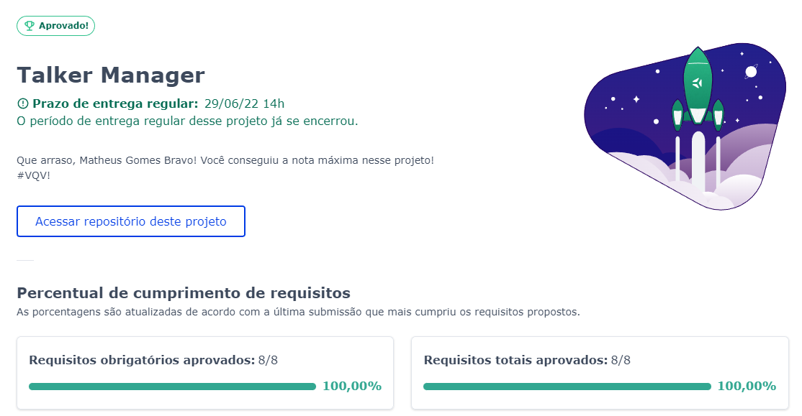

Foi construido uma aplicação de cadastro de talkers (palestrantes) em que será possível cadastrar, visualizar, pesquisar, editar e excluir informações. Aqui você encontra:

1. Uma API de um `CRUD` (**C**reate, **R**ead, **U**pdate e **D**elete) de palestrantes (talkers) e;
2. Alguns endpoints que irão ler e escrever em um arquivo utilizando o módulo `fs`.

Aprovado com 100% de aproveitamento.

